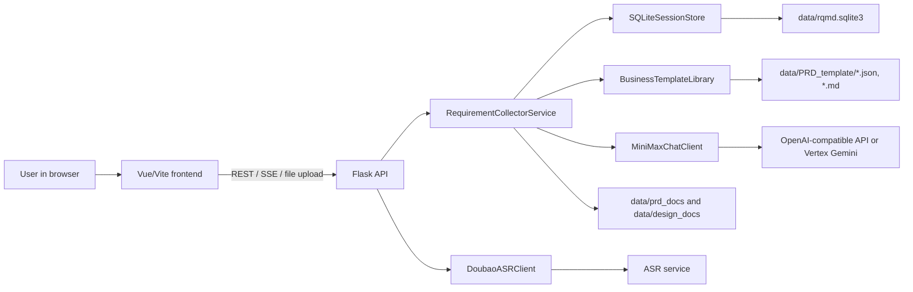

# AI PM Requirement Workspace

这是一个用于需求访谈、结构化需求沉淀、PRD/系统设计文档生成和编码交接的全栈项目。后端使用 Flask 提供 API、会话存储、LLM/ASR 集成和文档生成能力；前端使用 Vue 3 + TypeScript + Vite 提供 AI PM 对话、模板库、结构化需求面板和 Markdown 下载体验。

本文档面向后续接手维护的人，优先说明如何跑起来、系统如何工作、关键文件在哪里、改功能时应该从哪里入手。

IC Substrate 专家 AI PM 的上线验收清单见 [deploy/IC_Substrate_专家PM验收说明.md](deploy/IC_Substrate_专家PM验收说明.md)。

## 1. 功能概览

- AI PM 对话：围绕项目目标、角色、场景、规则、数据、验收标准等持续追问。
- 多语言支持：当前前端类型和后端服务支持 `en`、`de`、`zh`、`ms`。
- 会话管理：创建、查看、删除历史会话，支持会话标题、消息历史和结构化需求缓存。
- 业务模板库：从 `data/PRD_template` 读取多语言业务模板，可引导式启动，也可用示例需求快速启动。
- 结构化需求模型：把对话归纳成固定 JSON 模型，并在前端展示采集进度。
- 文档生成：生成 PRD 和系统设计文档，支持普通响应和 SSE 流式响应。
- 文档下载：生成的 Markdown 会保存到 `data/prd_docs` 和 `data/design_docs`，可通过 API 下载。
- Coding handoff：在 PRD 和设计文档都准备好后，生成短期有效的交接 token 和实现提示词。
- ASR 语音识别：前端可上传录音到后端 `/api/asr/recognize`，后端保存录音并调用 ASR 服务。

## 2. 技术栈

后端：

- Python 3
- Flask 3
- SQLite
- requests
- google-auth，供 Vertex Gemini 模式使用
- pydub、websocket-client，供语音相关能力使用

前端：

- Vue 3
- TypeScript
- Vite
- 原生 Fetch + SSE 流式读取

外部依赖：

- OpenAI-compatible LLM 接口，默认按 `/chat/completions` 调用
- Vertex Gemini，可选
- ASR 服务，可选，当前客户端类名为 `DoubaoASRClient`

## 3. 目录结构

```text
.
├── app/
│   ├── __init__.py                         # Flask app factory，加载环境变量、注册蓝图、初始化服务
│   ├── api.py                              # 后端 REST/SSE API
│   ├── routes.py                           # 根页面路由
│   ├── templates/index.html                # Flask 根路由返回的简单页面
│   └── services/
│       ├── asr_client.py                   # ASR 客户端
│       ├── business_template_library.py    # 业务模板读取、语言变体选择、Markdown/示例模型读取
│       ├── llm_client.py                   # LLM 客户端，支持 openai_compatible 和 vertex_gemini
│       ├── requirement_collector.py        # 核心业务服务：会话、对话、结构化需求、文档生成、handoff
│       ├── session_store.py                # SQLite 持久化，会自动建表和补列
│       └── structured_requirement_model.py # 结构化需求模型 schema、prompt 和规范化逻辑
├── data/
│   ├── PRD_template/                       # 多语言 PRD/业务模板，包含 .md 和 .json
│   ├── rqmd.sqlite3                        # 默认 SQLite 数据库，运行后生成
│   ├── prd_docs/                           # 生成的 PRD Markdown，运行后生成
│   └── design_docs/                        # 生成的设计文档 Markdown，运行后生成
├── frontend/
│   ├── package.json                        # 前端脚本和依赖
│   ├── vite.config.ts                      # Vite dev server，默认端口 9530，并代理 /api 到后端
│   └── src/
│       ├── App.vue                         # 主要前端页面和交互逻辑
│       ├── style.css                       # 全局样式
│       ├── components/                     # Markdown、结构化需求面板等组件
│       ├── lib/                            # 结构化需求进度计算
│       └── types/                          # API 和结构化需求 TypeScript 类型
├── tests/                                  # Python unittest 测试
├── recordings/                             # 语音识别上传的录音文件
├── requirements.txt                        # 后端依赖
├── run.py                                  # 后端启动入口
├── .env.example                            # 后端环境变量示例
└── README.md
```

## 4. 本地启动

### 4.1 后端

在项目根目录执行：

```powershell
python -m venv .venv
.venv\Scripts\Activate.ps1
python -m pip install -r requirements.txt
Copy-Item .env.example .env
python run.py
```

后端默认读取根目录 `.env`，默认监听：

```text
http://127.0.0.1:8000
```

说明：

- `run.py` 和 `app/__init__.py` 都会加载根目录 `.env`。
- 已经在系统环境变量中设置的值优先级更高，`.env` 只通过 `os.environ.setdefault` 补默认值。
- 如果要改端口，设置 `PORT=xxxx`。

### 4.2 前端

另开一个终端：

```powershell
cd frontend
npm install
npm run dev
```

前端默认监听：

```text
http://127.0.0.1:9530
```

Vite 配置里会把 `/api` 代理到：

```text
http://127.0.0.1:8000
```

所以本地开发时通常不需要在前端额外配置 `VITE_API_BASE_URL`。如果设置了 `VITE_API_BASE_URL`，前端代码会直接请求该地址，不再依赖同源代理。

### 4.3 推荐开发访问方式

后端：

```text
http://127.0.0.1:8000
```

前端：

```text
http://127.0.0.1:9530
```

日常调试以访问前端地址为主。

## 5. 环境变量

后端环境变量放在根目录 `.env`。可从 `.env.example` 复制后修改。

### 5.1 服务配置

| 变量 | 默认值 | 说明 |
| --- | --- | --- |
| `HOST` | `0.0.0.0` | Flask 监听地址 |
| `PORT` | `8000` | Flask 监听端口 |
| `DEBUG` | `True` | 是否开启 Flask debug |
| `CORS_ORIGINS` | `http://localhost:3000,http://localhost:5173,http://localhost:9530` | 允许的前端来源，当前实现会对 `/api/` 请求补 CORS 头 |
| `SQLITE_DB_PATH` | `data/rqmd.sqlite3` | SQLite 数据库路径 |
| `LOG_LEVEL` | `INFO` | Python logging 级别 |
| `LOG_FILE` | `app.log` | 示例配置，当前代码未统一写文件日志 |

### 5.2 LLM 配置

OpenAI-compatible 模式：

```env
LLM_PROVIDER=openai_compatible
LLM_BASE_URL=https://api.example.com/v1
LLM_API_KEY=your_api_key
LLM_MODEL=your_model_name
LLM_TIMEOUT_SECONDS=500
LLM_PROXY_URL=
LLM_MAX_RETRIES=2
LLM_DEBUG_STREAM=false
```

请求地址会拼成：

```text
{LLM_BASE_URL}/chat/completions
```

Vertex Gemini 模式：

```env
LLM_PROVIDER=vertex_gemini
LLM_MODEL=gemini-2.5-flash
LLM_GCP_PROJECT_ID=your-gcp-project-id
LLM_GCP_LOCATION=global
LLM_GCP_CREDENTIALS_PATH=C:\path\to\service-account.json
```

如果没有设置 `LLM_GCP_CREDENTIALS_PATH`，会回退读取 `GOOGLE_APPLICATION_CREDENTIALS`。

### 5.3 ASR 配置

```env
ASR_APP_ID=
ASR_ACCESS_TOKEN=
ASR_SECRET_KEY=
ASR_BASE_URL=http://10.125.110.103:8004/v1
```

ASR 用于 `/api/asr/recognize`。如果不需要语音识别，可以留空，但前端录音识别功能会不可用或返回后端错误。

### 5.4 前端运行时配置

Vite 只会自动读取 `frontend/.env`，不会读取根目录 `.env`。如需覆盖前端配置，请在 `frontend/.env` 中设置：

```env
VITE_API_BASE_URL=http://127.0.0.1:8000
VITE_GO_CODING_URL=http://localhost:8888
VITE_HOST=0.0.0.0
VITE_PORT=9530
```

注意：

- 不设置 `VITE_API_BASE_URL` 时，前端会请求同源 `/api`，由 Vite dev proxy 转发到后端。
- 设置 `VITE_API_BASE_URL` 后，前端会直接请求这个后端地址。
- `VITE_GO_CODING_URL` 用于点击 Go Coding 或 coding handoff 时拼接跳转地址。

## 6. 系统架构



核心链路：

1. 前端创建 session：`POST /api/sessions`。
2. 用户发送需求：`POST /api/sessions/{session_id}/messages/stream`。
3. 后端把用户消息和历史上下文发送给 LLM，流式返回 AI PM 回复。
4. 后端保存用户消息、AI 回复和结构化需求缓存。
5. 前端调用 `/structured-requirement` 拉取结构化需求模型，并展示采集进度。
6. 用户生成 PRD 或设计文档，后端再次调用 LLM，生成 Markdown 并保存。
7. 当 PRD 和设计文档都存在时，`/implementation-context` 和 `/coding-handoff` 可生成编码交接上下文。

## 7. 后端关键模块

### 7.1 `app/__init__.py`

负责创建 Flask app：

- 加载 `.env`
- 设置 CORS、SQLite、LLM、ASR 配置
- 初始化 `SQLiteSessionStore`
- 初始化 `MiniMaxChatClient`
- 初始化 `RequirementCollectorService`
- 初始化 `DoubaoASRClient`
- 注册 `api` 和 `main` 蓝图

修改环境变量、默认端口、服务初始化时，优先看这里。

### 7.2 `app/api.py`

所有后端 API 的入口。这里主要做：

- 解析 request payload 和 query
- 调用 `RequirementCollectorService`
- 捕获 `KeyError`、`ValueError`、`LLMError`、`ASRError`
- 返回 JSON、SSE 或文件下载响应

新增 API 时建议保持这个分层：API 层只做协议和错误映射，业务逻辑放到 service。

### 7.3 `app/services/requirement_collector.py`

项目最核心的业务服务，包含：

- PM 对话系统 prompt
- PRD、系统设计、implementation prompt 模板
- 会话创建和模板启动模式
- 普通和流式消息发送
- 结构化需求模型生成和缓存
- PRD/设计文档生成、保存和下载路径
- coding handoff token 生成和解析

这个文件较大，接手时建议先通过公开方法定位功能，再看私有 helper。常用入口：

| 方法 | 作用 |
| --- | --- |
| `create_session` | 创建普通或模板会话 |
| `send_user_message` | 非流式发送用户消息 |
| `stream_user_message` | 流式发送用户消息 |
| `build_structured_requirement_model` | 生成结构化需求模型 |
| `build_prd_document` / `stream_prd_document` | 生成 PRD |
| `build_system_design_document` / `stream_system_design_document` | 生成系统设计文档 |
| `build_implementation_context` | 读取已生成文档并组装实现上下文 |
| `create_coding_handoff` / `resolve_coding_handoff` | 创建和解析 coding handoff token |

### 7.4 `app/services/session_store.py`

SQLite 持久化层，启动时会自动建表：

- `sessions`
- `messages`
- `coding_handoffs`

它还会通过 `_ensure_session_columns` 和 `_ensure_message_columns` 给旧库补列，所以本地已有数据库通常可以平滑升级。

### 7.5 `app/services/llm_client.py`

LLM 客户端，支持两种 provider：

- `openai_compatible`：请求 `{base_url}/chat/completions`
- `vertex_gemini`：请求 Google Vertex AI Gemini

流式模式会拆分：

- `content`
- `thinking`

并处理 `<think>...</think>` 内容。

### 7.6 `app/services/business_template_library.py`

从 `data/PRD_template` 加载 JSON 模板，提供：

- 模板列表
- 模板详情
- 语言变体选择
- 模板 Markdown 读取
- example model 读取
- prompt 上下文构建

新增业务模板时，重点保证 `.json` 中的 `template_id`、`template_key`、`language`、`render_config.markdown_relative_path` 和 `example_model` 正确。

## 8. 前端关键模块

### 8.1 `frontend/src/App.vue`

当前主要 UI 和交互集中在一个大组件里，包含：

- 多语言文案
- 会话列表和模板列表
- 对话发送和 SSE 读取
- 结构化需求拉取
- PRD/设计文档生成
- Markdown 下载
- Go Coding handoff 跳转
- 录音和 ASR 上传

如果要拆分前端，建议优先把 API client、i18n 文案、录音逻辑、会话列表、模板页和聊天区拆出去。

### 8.2 `frontend/src/types`

维护前后端响应类型：

- `session.ts`：会话、消息、生成文档、handoff 类型
- `businessTemplate.ts`：模板摘要和详情类型
- `structuredRequirement.ts`：结构化需求模型和规范化函数

后端 API 字段变更时，要同步检查这里。

### 8.3 `frontend/src/components`

重要组件：

- `StructuredRequirementPanel.vue`：结构化需求面板
- `RequirementMarkdownPreview.vue`：需求 Markdown 预览
- `MarkdownRenderer.vue`：Markdown 渲染
- `structuredRequirementCopy.ts`：结构化需求面板多语言文案

### 8.4 `frontend/src/lib/structuredRequirementProgress.ts`

根据 `collection_status` 计算采集进度。后端结构化需求模型字段变更时，也要同步调整这里。

## 9. API 速查

### 9.1 会话

| 方法 | 路径 | 说明 |
| --- | --- | --- |
| `POST` | `/api/sessions` | 创建会话，可传 `template_id`、`template_start_mode`、`language` |
| `GET` | `/api/sessions` | 获取会话列表 |
| `GET` | `/api/sessions/{session_id}` | 获取会话详情 |
| `DELETE` | `/api/sessions/{session_id}` | 删除会话 |
| `POST` | `/api/sessions/{session_id}/prompt-template` | 更新普通 prompt 模式，已有用户消息后会限制修改 |

创建会话示例：

```http
POST /api/sessions
Content-Type: application/json

{
  "language": "en",
  "template_id": "business_process_requirement_template_en",
  "template_start_mode": "guided"
}
```

`template_start_mode`：

- `guided`：只应用模板，不预填示例对话。
- `example`：用模板中的 `example_model` 种子数据启动，适合演示和快速生成文档。

### 9.2 模板

| 方法 | 路径 | 说明 |
| --- | --- | --- |
| `GET` | `/api/templates` | 获取模板列表 |
| `GET` | `/api/templates/{template_id}` | 获取模板详情、Markdown 和 example model |

### 9.3 对话和结构化需求

| 方法 | 路径 | 说明 |
| --- | --- | --- |
| `POST` | `/api/sessions/{session_id}/messages` | 发送用户消息，非流式 |
| `POST` | `/api/sessions/{session_id}/messages/stream` | 发送用户消息，SSE 流式 |
| `GET` | `/api/sessions/{session_id}/summary` | 生成结构化摘要，旧命名 |
| `GET` | `/api/sessions/{session_id}/structured-requirement` | 生成结构化需求模型 |

发送消息示例：

```http
POST /api/sessions/{session_id}/messages
Content-Type: application/json

{
  "message": "We want to build an attendance system for SMB companies.",
  "language": "en"
}
```

### 9.4 文档生成和下载

| 方法 | 路径 | 说明 |
| --- | --- | --- |
| `GET` | `/api/sessions/{session_id}/prd-doc` | 生成 PRD 快照，不写入消息历史 |
| `POST` | `/api/sessions/{session_id}/prd-doc` | 生成 PRD 并写入消息历史 |
| `POST` | `/api/sessions/{session_id}/prd-doc/stream` | 流式生成 PRD 并写入消息历史 |
| `GET` | `/api/sessions/{session_id}/design-doc` | 生成设计文档快照，不写入消息历史 |
| `POST` | `/api/sessions/{session_id}/design-doc` | 生成设计文档并写入消息历史 |
| `POST` | `/api/sessions/{session_id}/design-doc/stream` | 流式生成设计文档并写入消息历史 |
| `GET` | `/api/sessions/{session_id}/prd-doc/download` | 下载最近 PRD |
| `GET` | `/api/sessions/{session_id}/design-doc/download` | 下载最近设计文档 |
| `GET` | `/api/sessions/{session_id}/messages/{message_id}/download` | 下载某条文档消息对应文件 |

### 9.5 Coding handoff

| 方法 | 路径 | 说明 |
| --- | --- | --- |
| `GET` | `/api/sessions/{session_id}/implementation-context` | 获取 PRD、设计文档路径和实现提示词 |
| `POST` | `/api/sessions/{session_id}/coding-handoff` | 创建 handoff token |
| `GET` | `/api/coding-handoffs/{token}` | 解析 handoff token |

注意：`implementation-context` 和 `coding-handoff` 依赖已生成的 PRD 与设计文档，否则会返回缺失文档错误。

### 9.6 ASR

| 方法 | 路径 | 说明 |
| --- | --- | --- |
| `POST` | `/api/asr/recognize` | 上传 `audio` 文件并返回识别文本 |

示例：

```http
POST /api/asr/recognize
Content-Type: multipart/form-data

audio=<wav file>
```

## 10. 数据和文件落盘

默认运行时会写入这些路径：

| 路径 | 说明 |
| --- | --- |
| `data/rqmd.sqlite3` | SQLite 数据库 |
| `data/prd_docs/{session_id}.md` | 某 session 最近一次 PRD |
| `data/prd_docs/{document-label}-{timestamp}.md` | 版本化 PRD 文件 |
| `data/design_docs/{session_id}.md` | 某 session 最近一次设计文档 |
| `data/design_docs/{document-label}-{timestamp}.md` | 版本化设计文档 |
| `recordings/recording_{timestamp}_{uuid}.wav` | ASR 上传的录音 |

接手时需要注意：

- `data/PRD_template` 是模板源数据，应该纳入版本管理。
- `data/rqmd.sqlite3`、`data/prd_docs`、`data/design_docs`、`recordings` 更像运行时产物，是否提交取决于团队约定。
- 生成文档时，后端既会写入版本化文件，也会覆盖 `{session_id}.md` 作为最近版本。

## 11. 测试

当前测试使用 Python `unittest`。

运行全部后端测试：

```powershell
python -m unittest discover -s tests
```

前端类型检查和构建：

```powershell
cd frontend
npm run build
```

当前测试重点覆盖：

- 多语言 implementation prompt
- 模板详情和 example model
- 模板示例启动
- 示例会话生成 PRD 和流式文档

新增功能建议：

- 改 `RequirementCollectorService` 时，优先给 service 层加 unittest。
- 改模板格式时，补充 `BusinessTemplateLibrary` 或模板完整性测试。
- 改 API 响应字段时，同步更新前端 `types`，并至少跑一次 `npm run build`。

## 12. 常见开发任务

### 12.1 新增一个 API

1. 在 `app/api.py` 添加路由，解析 payload/query。
2. 在 `RequirementCollectorService` 添加业务方法。
3. 如需持久化，扩展 `SQLiteSessionStore`，并考虑旧库自动补列。
4. 前端新增调用时，同步更新 `frontend/src/types`。
5. 补测试。

### 12.2 修改 AI PM 对话策略

主要看 `app/services/requirement_collector.py`：

- `PM_SYSTEM_PROMPT`
- `PM_SYSTEM_PROMPT_ZH`
- personal project addendum
- business template addendum 相关 helper
- `_pm_prompt`

注意保留“每轮只问一个最高价值澄清问题”的约束，否则产品体验会变成问卷。

### 12.3 修改 PRD 或设计文档结构

主要看：

- `PRD_DOC_SYSTEM_PROMPT`
- `DESIGN_DOC_SYSTEM_PROMPT`
- `DESIGN_DOC_SYSTEM_PROMPT_ZH`
- `PRD_TEMPLATE_FILE_BY_LANGUAGE`
- `data/PRD_template/simple-prd-template.*.md`
- 业务模板对应的 `.md` 和 `.json`

如果模板章节字段变了，要同时检查前端模板详情展示和测试。

### 12.4 新增业务模板

在 `data/PRD_template` 增加：

- 一个 Markdown 模板文件，例如 `xxx-template.en.md`
- 一个 JSON 元数据文件，例如 `xxx-template.en.json`

JSON 至少需要：

- `template_id`
- `template_key`
- `template_name`
- `template_category`
- `business_domain`
- `language`
- `version`
- `description`
- `sections`
- `render_config.markdown_relative_path`
- `example_model`

多语言模板应共享同一个 `template_key`，并使用不同 `language`。`BusinessTemplateLibrary` 会按 `template_key + language` 查找本地化变体。

### 12.5 修改结构化需求模型

需要同步修改：

- 后端 schema 和 prompt：`app/services/structured_requirement_model.py`
- 后端解析和 progress：`RequirementCollectorService._structured_requirement_progress`
- 前端类型：`frontend/src/types/structuredRequirement.ts`
- 前端进度计算：`frontend/src/lib/structuredRequirementProgress.ts`
- 前端展示：`StructuredRequirementPanel.vue`、`RequirementMarkdownPreview.vue`

### 12.6 修改 Go Coding handoff

主要看：

- `RequirementCollectorService.build_implementation_context`
- `RequirementCollectorService.build_browser_handoff_payload`
- `RequirementCollectorService.create_coding_handoff`
- `RequirementCollectorService.resolve_coding_handoff`
- `frontend/src/App.vue` 中 `openGoCoding` 相关逻辑

handoff 依赖已保存的 PRD 和设计文档，所以调试前先生成这两类文档。

### 12.7 修改 ASR

主要看：

- `app/services/asr_client.py`
- `app/api.py` 的 `/api/asr/recognize`
- `frontend/src/App.vue` 的录音和上传逻辑

当前 API 会把上传音频保存到 `recordings`，再调用 ASR 客户端。

## 13. 排障指南

### 13.1 前端请求不到后端

检查：

- 后端是否运行在 `http://127.0.0.1:8000`
- 前端是否运行在 `http://127.0.0.1:9530`
- `frontend/vite.config.ts` 的 proxy target 是否正确
- 是否设置了错误的 `frontend/.env` 里的 `VITE_API_BASE_URL`
- 后端 `CORS_ORIGINS` 是否包含当前前端地址

### 13.2 LLM 返回 401/403

检查：

- `LLM_API_KEY`
- `LLM_BASE_URL`
- `LLM_MODEL`
- provider 是否应为 `openai_compatible` 或 `vertex_gemini`
- 如果走代理，检查 `LLM_PROXY_URL`

### 13.3 LLM 请求超时

可调整：

```env
LLM_TIMEOUT_SECONDS=500
LLM_MAX_RETRIES=2
LLM_PROXY_URL=http://127.0.0.1:7890
```

也可以临时打开：

```env
LLM_DEBUG_STREAM=true
LOG_LEVEL=INFO
```

### 13.4 生成 implementation context 报缺文档

需要先生成并保存：

- PRD：`POST /api/sessions/{session_id}/prd-doc`
- 设计文档：`POST /api/sessions/{session_id}/design-doc`

或从前端点击生成文档。仅有对话历史不够。

### 13.5 模板列表为空

检查：

- `data/PRD_template` 是否存在
- JSON 文件是否是合法 JSON
- JSON 中是否包含 `template_id`
- `status` 是否为 `disabled`
- `render_config.markdown_relative_path` 指向的 Markdown 文件是否存在

### 13.6 结构化需求面板为空或进度异常

检查：

- `/api/sessions/{session_id}/structured-requirement` 返回内容
- LLM 输出是否能解析出 JSON
- `structured_requirement_cache` 是否是旧格式
- 前端 `extractStructuredRequirementModel` 是否能识别字段

### 13.7 ASR 失败

检查：

- `ASR_BASE_URL`
- `ASR_APP_ID`
- `ASR_ACCESS_TOKEN`
- `ASR_SECRET_KEY`
- 上传字段名必须是 `audio`
- `recordings` 目录是否可写

## 14. 已知注意点

- 根目录 `.env.example` 中的前端 `VITE_*` 变量不会被 Vite 自动读取。前端覆盖项应放在 `frontend/.env`。
- 后端默认端口是 `8000`，不是旧 README 中提到的 `5000`。
- `RequirementCollectorService` 文件很大，改动前建议先用方法名定位，不要直接大范围重构。
- 前端 `App.vue` 也很大，适合后续逐步拆分，但短期改动应保持行为稳定。
- SQLite schema 会自动补列，但复杂迁移仍建议写一次性迁移脚本或明确升级步骤。
- 流式接口返回的是 SSE，前端不是使用 `EventSource`，而是用 `fetch` 读取 response stream。
- 文档生成会调用 LLM，测试里使用 fake client，避免真实外部调用。

## 15. 提交前检查清单

后端改动：

```powershell
python -m unittest discover -s tests
```

前端改动：

```powershell
cd frontend
npm run build
```

手动冒烟：

1. 启动后端 `python run.py`。
2. 启动前端 `npm run dev`。
3. 打开 `http://127.0.0.1:9530`。
4. 新建会话并发送一条需求。
5. 确认 AI PM 回复正常。
6. 确认结构化需求面板能更新。
7. 生成 PRD 和设计文档。
8. 下载 Markdown。
9. 如涉及 handoff，确认能创建 coding handoff token。

## 16. 快速命令汇总

后端：

```powershell
python -m venv .venv
.venv\Scripts\Activate.ps1
python -m pip install -r requirements.txt
Copy-Item .env.example .env
python run.py
```

前端：

```powershell
cd frontend
npm install
npm run dev
```

测试：

```powershell
python -m unittest discover -s tests
cd frontend
npm run build
```

常用地址：

```text
Backend:  http://127.0.0.1:8000
Frontend: http://127.0.0.1:9530
```
